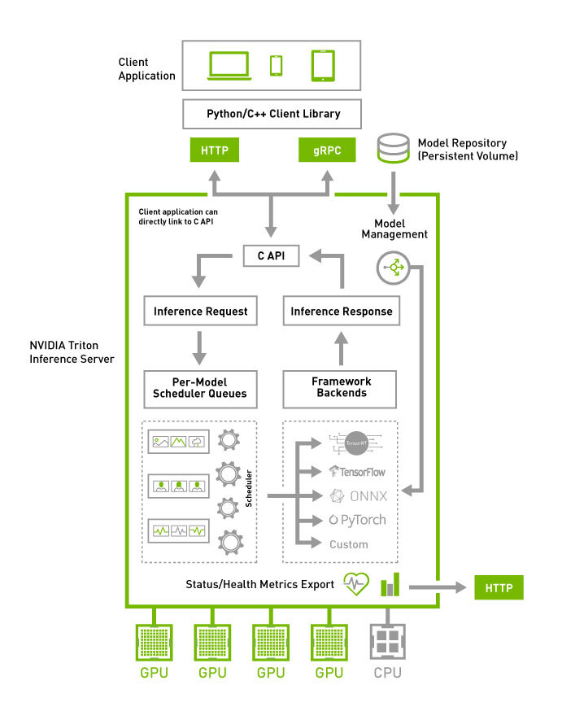

# Kiến trúc & Luồng hoạt động

Một Triton Inference Server, hai model tiếng Việt độc lập:

| model | backend | scheduler | vào → ra |
|---|---|---|---|
| `asr_streaming` | Python, GPU ×2 | `sequence_batching` (oldest, 8 phiên) | chunk audio 16kHz → partial transcript |
| `tts` | Python, GPU ×1 | không batch (`max_batch_size: 0`) | text + giọng mẫu → waveform 24kHz |

Client dùng gRPC (8001). HTTP (8000) và metrics Prometheus (8002) cũng mở.

## Triton chạy thế nào



*Nguồn: [NVIDIA — Triton Architecture](https://docs.nvidia.com/deeplearning/triton-inference-server/user-guide/docs/user_guide/architecture.html)*

Request vào qua HTTP/gRPC/C-API → **per-model scheduler queue** → scheduler của model đó
→ backend → response. Model repository là một volume, Triton đọc `config.pbtxt` để biết
mỗi model dùng scheduler nào, mấy instance, chạy trên thiết bị nào.

Hai chỗ project này dựa vào:

- **Scheduler chọn theo model.** `asr_streaming` dùng sequence batcher vì phải giữ state;
  `tts` không batch vì câu dài ngắn khác nhau.
- **Backend là Python cho cả hai.** Không phải ONNX backend — logic streaming và flow
  matching không diễn đạt được bằng một đồ thị tensor tĩnh ([lý do chi tiết](ensemble-vs-one-backend.md)).

## Flow ASR streaming

Checkpoint [`hynt/Zipformer-30M-RNNT-Streaming-6000h`](https://huggingface.co/hynt/Zipformer-30M-RNNT-Streaming-6000h),
ONNX fp16, biến thể `chunk-16-left-128` (đổi qua `CHUNK_VARIANT` trong `scripts/fetch_models.sh`).

```
client mở 1 gRPC stream, gửi chunk 200ms kèm sequence_id + START/END
   │
   ▼
sequence batcher (oldest)  ── ghim mọi chunk cùng sequence_id vào 1 instance, đúng thứ tự
   │
   ▼
execute()  ── tra _Stream theo CORRID
   │
   ├─► StreamingFbank      20 khung mới/chunk, gộp vào buffer
   │
   ├─► encoder.onnx        chạy khi buffer ≥ 45 khung; ăn 45, tiêu thụ 32, 13 là lookahead
   │                       75 input / 75 output: x + 74 tensor cache vào, feature + cache mới ra
   │
   └─► greedy_search_step  mỗi khung: joiner → argmax → non-blank thì nối vào hypothesis
                                                        và chạy lại decoder
   │
   ▼
partial transcript (toàn bộ token đã phát tới lúc đó)
```

Những chỗ đáng chú ý:

1. **Không đệm gì cả.** `AUDIO_CHUNK` khai `dims: [-1]` nên chunk cuối ngắn hơn vẫn gửi thẳng được.

2. **`CORRID` là khoá của state.** Sequence batcher đảm bảo mọi request trong một sequence
   đi về cùng model instance, nên giữ state trong process là hợp lệ. Chiến lược `oldest`
   *"ensures that all inference requests in a sequence are routed to the same model instance
   and then uses the dynamic batcher to batch together multiple inferences from different
   sequences"* ([Triton Architecture](https://docs.nvidia.com/deeplearning/triton-inference-server/user-guide/docs/user_guide/architecture.html)).

3. **`_Stream` giữ 4 thứ:** `StreamingFbank`, buffer khung chưa đủ một bước encoder,
   74 tensor cache của encoder, và `SearchState` của greedy.

4. **fbank dần khớp từng số với fbank cả câu.** Mỗi lần vẫn gọi `kaldi.fbank` trên buffer
   nhưng chỉ phát khung nào có cửa sổ 25ms nằm trọn trong phần mẫu thật; khung dính
   reflection ở mép giữ lại tính sau. Reflection thật chỉ còn ở đầu stream và lúc flush —
   đúng hai chỗ bản offline cũng reflect.

5. **Cache encoder ghép theo vị trí**, không viết cứng tên hay số lượng, nên export đổi
   số layer thì code vẫn đúng. `T = 45` và `decode_chunk_len = 32` đọc từ metadata của
   chính file ONNX. Chunk 200ms chỉ nạp 20 khung → khoảng 3/5 số chunk mới kích được encoder.

6. **`END` thì flush:** đệm `LOG_EPS` cho đủ một bước encoder chót, trả bản final, xoá state.

7. **Stream chết không gửi `END`:** Triton huỷ sequence sau `max_sequence_idle` 60s;
   `_sweep()` xoá state mồ côi với TTL soi gương đúng con số đó. Không có nó thì dict
   `streams` rò rỉ vĩnh viễn.

8. **Lỗi cô lập theo sequence:** `execute()` bọc từng request trong try/except và trả
   `TritonError` riêng, để một stream hỏng không kéo đổ các stream khác cùng batch.

## Flow TTS

```
TEXT (+ PROMPT_WAV, PROMPT_TEXT, NUM_STEPS, SPEED, GUIDANCE_SCALE tuỳ chọn)
   │
   ▼
EspeakTokenizer (espeak-ng, lang=vi)   text → phoneme
   │
   ▼
ZipVoice flow matching, N bước (mặc định 16)
   từ nhiễu sinh dần mel-spectrogram, điều kiện theo phoneme + giọng mẫu
   │
   ▼
vocos   mel → waveform
   │
   ▼
WAV + SAMPLE_RATE = 24000
```

- **Zero-shot bắt buộc có giọng mẫu.** Không truyền prompt thì dùng bản đóng gói sẵn ở
  `model_repository/tts/1/assets/`.
- **`max_batch_size: 0`** — câu dài ngắn khác nhau, đệm sẽ rất phí. Song song lấy qua
  `instance_group.count`.
- **Ghi tạm ra `/dev/shm`** (tmpfs, RAM) vì `generate_sentence` của ZipVoice nhận đường
  dẫn file chứ không nhận tensor.
- **Server luôn đọc prompt ở 16kHz**, nên `tts_client.py` hạ tần số file `--prompt` trước
  khi gửi. Gửi thẳng 24kHz vào thì giọng mẫu chậm 1.5 lần mà không báo lỗi.

## Nút thắt hiện tại

`asr_streaming` chạm trần ~135 infer/s trong khi GPU mới 74-76%. Nguyên nhân nằm ở
`model.py`: `execute()` nhận cả batch rồi duyệt `for request in requests` xử lý tuần tự,
nên encoder chạy 8 lần với batch=1 thay vì 1 lần với batch=8.

Đo trực tiếp trên `encoder.onnx` (RTX 3050, fp16, CUDA EP):

| batch | ms/lần gọi | ms mỗi chunk |
|---|---|---|
| 1 | 11.00 | 11.00 |
| 8 | 14.37 | **1.80** |

Gộp 8 chunk tốn 14.37ms, tám lần gọi riêng tốn 88ms. Encoder 30M tham số fp16 ≈ 60MB
trọng số phải đọc từ VRAM mỗi lần gọi để xử lý 7KB audio — batch amortize việc đọc đó.

Sửa đúng chỗ là stack request trong `execute()`, không phải tách model
([vì sao](ensemble-vs-one-backend.md)).

## Số đo hiện hành

`bench/asr_streaming/README.md`, `bench/tts/README.md`. Ranh giới perf_analyzer / script
tự viết: `bench/README.md`.

## Nguồn

- [Triton Architecture](https://docs.nvidia.com/deeplearning/triton-inference-server/user-guide/docs/user_guide/architecture.html) — scheduler, sequence batcher, ensemble
- [Model Configuration](https://docs.nvidia.com/deeplearning/triton-inference-server/user-guide/docs/user_guide/model_configuration.html) — `instance_group`, `max_batch_size`, dynamic batcher
- [Implicit State Management](https://docs.nvidia.com/deeplearning/triton-inference-server/user-guide/docs/user_guide/implicit_state_management.html)
- [Business Logic Scripting](https://docs.nvidia.com/deeplearning/triton-inference-server/user-guide/docs/user_guide/bls.html)
- [Python Backend](https://docs.nvidia.com/deeplearning/triton-inference-server/user-guide/docs/python_backend/README.html)
